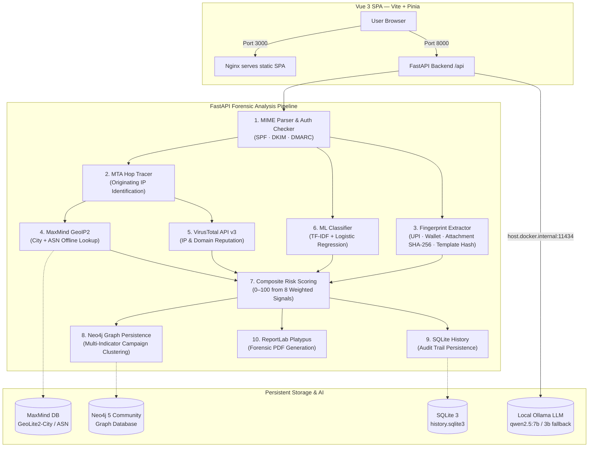

# TraceMail AI — Phishing & Scam Intelligence Platform

**Smart India Hackathon (SIH26106) · Theme: Blockchain & Cybersecurity · Team Cyber Link**

TraceMail AI is an AI-powered email threat detection, geolocation, and forensic intelligence
platform. It doesn't just flag one suspicious email — it links separately reported complaints into
coordinated scam campaigns by matching shared infrastructure (IPs, domains, UPI handles, crypto
wallets, attachment file hashes, and HTML template fingerprints) in a Neo4j property graph. Each
analysis walks the full RFC 822 MIME tree to trace originating IPs across relay hops, runs content
through a pre-trained ML classifier (98.9% accuracy on 84,665 real emails), geolocates sending
infrastructure with local MaxMind databases, cross-references threat intelligence via VirusTotal,
computes a composite 0–100 risk score from 8 weighted signals, and generates court-ready forensic
PDF evidence — all backed by plain-language AI explanations from a locally hosted Ollama LLM with
zero cloud dependencies or rate limits.

---

## 🎥 Project Demo

Watch TraceMail AI in action:

https://github.com/user-attachments/assets/7d804f9f-574d-42a1-b947-ef888653cd62


## System Architecture



---

## Prerequisites

| Dependency | Required | Notes |
|---|---|---|
| **Docker & Docker Compose** | Yes | Docker Desktop (macOS / Windows) or Docker Engine (Linux) |
| **Ollama** | Yes | Runs on the host for native GPU / Apple Silicon acceleration |
| **MaxMind GeoLite2** | Yes | Free account at [maxmind.com/en/geolite2/signup](https://www.maxmind.com/en/geolite2/signup) |
| **VirusTotal API key** | Optional | Free tier at [virustotal.com](https://www.virustotal.com); degrades gracefully without it |

### Prepare Ollama Models

```bash
# Install from https://ollama.ai, then pull both models:
ollama pull qwen2.5:7b
ollama pull qwen2.5:3b
ollama serve    # verify: curl http://localhost:11434/api/tags
```

### Place MaxMind Databases

Download `GeoLite2-City.mmdb` and `GeoLite2-ASN.mmdb` and place them at:

```
backend/app/geo/data/GeoLite2-City.mmdb
backend/app/geo/data/GeoLite2-ASN.mmdb
```

---

## Quick Start

```bash
# 1. Clone & configure
git clone <repo-url> && cd phishtrace_ai
cp .env.example .env
# Edit .env — set VIRUSTOTAL_API_KEY if available (leave blank to skip)

# 2. Ensure Ollama is running on host
ollama serve &

# 3. Launch all services
docker compose up --build -d

# 4. Open in browser
open http://localhost:3000          # Web Dashboard
open http://localhost:8000/docs     # FastAPI Interactive Docs
open http://localhost:7474          # Neo4j Browser (neo4j / trashmail123)
```

### Local Development (without Docker)

```bash
# Backend
cd backend
python -m venv venv && source venv/bin/activate
pip install -r requirements.txt
uvicorn app.main:app --reload --port 8000

# Frontend (separate terminal)
cd frontend
npm install
npm run dev     # http://localhost:5173
```

### Running Tests

```bash
cd backend
source venv/bin/activate
PYTHONPATH=. pytest tests/ -v
```

The test suite covers 85+ tests across 15 test modules — parser, hops, fingerprints, classifier,
risk scoring, GeoIP, VirusTotal, Neo4j client, history, reports, chat, batch, and API integration.

---

## Feature Groups

### 1. Single Email Forensics

Submit a raw email (paste RFC 822 text or upload `.eml`) and receive:

- **Header authentication** — SPF, DKIM, DMARC status with domain-alignment checks (Reply-To / Return-Path mismatch detection)
- **MTA hop reconstruction** — chronologically ordered relay chain with timestamps, hostnames, and IP addresses; private-vs-public boundary classification to identify the originating public IP
- **ML threat classification** — TF-IDF (1–2 gram, 40K features) + Logistic Regression pipeline returns a phishing probability, plus explainability (top contributing phrases with coefficient weights)
- **Composite risk score** — 0–100 score weighted across 8 signals: ML probability (50 pts), SPF/DKIM/DMARC failures, Reply-To/Return-Path mismatches, suspicious attachments, and VirusTotal reputation hits
- **Geolocation** — offline MaxMind GeoLite2-City and ASN lookup, rendered on a Leaflet OpenStreetMap tile
- **Threat intelligence** — VirusTotal API v3 for IP and domain reputation with in-memory IOC caching and 4 req/min free-tier rate limiting
- **Financial fingerprints** — extraction of UPI IDs (50+ Indian bank handles), Bitcoin (Bech32 + Base58), Ethereum wallets, and bank account numbers near banking keywords
- **Attachment hashing** — SHA-256 content hashing of every attachment for cross-email deduplication
- **Template fingerprinting** — structural HTML tag skeleton hash (attributes/content stripped) to identify mass-campaign templates
- **Plain-language AI briefing** — "Explain this analysis" button sends scored results (not raw email) to local Ollama LLM, structured as Verdict → Key Evidence → Infrastructure → Recommended Action
- **Forensic PDF export** — downloadable court-ready evidence report generated with ReportLab Platypus

### 2. Batch Analysis & Campaign Detection

Upload up to 20 `.eml` files simultaneously. The batch view provides:

- Aggregate statistics — total analyzed, phishing/suspicious/safe breakdown
- Per-email result cards with verdict badges, risk scores, and PDF download links
- Automatic campaign cluster detection — connected components across shared infrastructure
- Multi-indicator correlation pills — shows exactly which indicators are shared (IP, domain, UPI, wallet, attachment hash, template hash) with strength badges (strong / moderate / weak)
- Attachment Intelligence panel — surfaces reused attachments across the batch: total found, unique count, reused count, and for each reused hash the distinct filenames it appeared under

### 3. Campaign Graph & Clustering

The Clusters page renders a full cross-database vis-network graph of all analyzed emails:

- Nodes are typed (Email, IP, Domain, UPI, Wallet, AttachmentHash, TemplateHash) and color-coded
- Interactive graph with search, node selection, and an inspector panel showing details of the selected entity
- Automatically computed connected components (clusters) identify coordinated campaigns
- Cluster selection highlights all member nodes in the graph

### 4. Campaign Reports

The Reports page aggregates campaign-level intelligence per cluster:

- Shared indicators matrix — domains, IPs, UPI handles, wallets, attachment hashes, template hashes shared across member emails
- Risk distribution and highest-risk classification (Critical / High / Medium / Safe)
- Unique senders, targets, and subjects per campaign
- Print-optimized layout for investigator briefing documents

### 5. Investigation History & Dashboard

- **Investigations** — persistent SQLite audit trail of every analysis, searchable/filterable by verdict, with one-click reload and PDF download
- **Dashboard** — summary stats (total analyzed, phishing/suspicious/safe counts), risk score distribution chart, and recent analysis list

### 6. AI Chat Assistant

Two modes of AI interaction, both powered by a locally hosted Ollama LLM:

| Mode | Endpoint | Description |
|---|---|---|
| **Explain Analysis** | `POST /api/chat/explain` | Grounded, single-shot explanation of a specific email's scored findings. Passes only structured results (not raw email body) to prevent prompt injection. |
| **Scam Query Assistant** | `POST /api/chat/ask` | Multi-turn conversational assistant with history (last 10 turns). Adapts to context — evaluates new text when asked, or has a natural follow-up conversation. |

Both use a primary → fallback model strategy (`qwen2.5:7b` → `qwen2.5:3b`) with graceful error handling when Ollama is unavailable.

---

## Backend Module Map

```
backend/app/
├── main.py                  # FastAPI app, CORS, lifespan (pre-warms ML model + SQLite)
├── core/
│   └── config.py            # pydantic-settings: CORS, Neo4j, Ollama, VT config
├── api/
│   ├── routes_analyze.py    # POST /api/analyze, GET /api/model-info
│   ├── routes_batch.py      # POST /api/analyze/batch (multi-file upload)
│   ├── routes_chat.py       # POST /api/chat/explain, POST /api/chat/ask
│   ├── routes_graph.py      # GET /api/graph/{hash}, /related, /overview, /attachments, /report
│   ├── routes_history.py    # GET /api/history, GET /api/history/{hash}
│   └── routes_reports.py    # GET /api/reports/{hash}.pdf
├── parsing/
│   ├── email_parser.py      # RFC 822 MIME tree walker, header extraction, URL/attachment parsing
│   ├── hops.py              # Received-header hop reconstruction, originating IP identification
│   └── fingerprints.py      # UPI, crypto wallet, bank account, attachment hash, template hash
├── ml/
│   ├── classifier.py        # Scikit-learn pipeline loader, classify_text(), explain_classification()
│   ├── risk_scoring.py      # Composite 0–100 risk score from 8 weighted signals
│   └── model/
│       ├── phishtrace_classifier.joblib   # Pre-trained TF-IDF + LogisticRegression pipeline
│       └── model_metadata.json            # Training dataset sizes, sources, evaluation metrics
├── geo/
│   ├── geoip.py             # MaxMind GeoLite2-City + ASN reader (cached singleton)
│   └── data/                # GeoLite2-City.mmdb, GeoLite2-ASN.mmdb (user-supplied)
├── intel/
│   └── virustotal.py        # VT API v3 client: IP & domain checks, rate limiting, IOC cache
├── graph/
│   └── neo4j_client.py      # Graph persistence, 2-hop queries, multi-indicator correlation,
│                            #   cluster computation, attachment intelligence
├── chat/
│   ├── ollama_client.py     # Async Ollama REST client: /api/generate + /api/chat, primary/fallback
│   └── prompts.py           # System prompts for explain-findings and freeform-assistant modes
├── db/
│   └── history.py           # SQLModel + SQLite persistence: save/query/delete investigations
└── reports/
    ├── pdf_report.py        # ReportLab Platypus forensic PDF generator
    └── cluster_report.py    # Campaign-level cluster aggregation engine
```

## Frontend View Map

```
frontend/src/
├── views/
│   ├── AnalyzeView.vue        # Email submission form (paste text or upload .eml)
│   ├── ResultsView.vue        # Single-email analysis results
│   ├── BatchAnalyzeView.vue   # Multi-file batch analysis with campaign detection
│   ├── DashboardView.vue      # Summary stats and recent analysis activity
│   ├── HistoryView.vue        # Searchable investigation audit trail
│   ├── ClustersView.vue       # Full cross-database vis-network campaign graph
│   └── ReportsView.vue        # Campaign-level aggregated reports
├── components/
│   ├── VerdictCard.vue               # Verdict badge, risk score, indicator pills, tech details
│   ├── NetworkGraphPanel.vue         # vis-network graph renderer with multi-indicator correlation
│   ├── AttachmentIntelligencePanel.vue  # Reused attachment forensics panel
│   ├── GeoMapPanel.vue               # Leaflet map of originating server location
│   ├── HopTimeline.vue               # Visual MTA relay chain timeline
│   ├── ChatPanel.vue                 # Dual-mode AI chat (explain + freeform)
│   ├── ModelInfoFooter.vue           # ML model metadata display
│   ├── ReportButton.vue              # PDF download trigger
│   └── AppSidebar.vue                # Navigation sidebar with live verdict indicator
├── stores/
│   └── analysis.js                   # Pinia store for analysis state management
├── api/
│   └── client.js                     # Axios API service layer
└── router/
    └── index.js                      # Vue Router route definitions
```

---

## Machine Learning Verification

The core classifier pipeline (`phishtrace_classifier.joblib`) is a **TF-IDF (1–2 gram, 40,000 features) + Logistic Regression** pipeline trained on **84,665 deduplicated real emails** from six major public cyber corpora:

| Dataset | Emails |
|---|---|
| Nazario Phishing Corpus | 1,565 |
| Nigerian Fraud (419) Emails | 3,332 |
| CEAS 2008 Spam Challenge | 39,154 |
| SpamAssassin Public Corpus | 5,809 |
| Ling-Spam Corpus | 2,859 |
| Enron-Spam Corpus | 29,767 + 33,716 |

### Evaluation Metrics (12,700 test emails)

| Metric | Value |
|---|---|
| **Accuracy** | 98.94% |
| **Precision** | 98.86% |
| **Recall** | 99.12% |
| **F1-Score** | 98.99% |

**Confusion Matrix**: `[[5955, 76], [59, 6610]]` — 76 false positives out of 6,031 legitimate; 59 false negatives out of 6,669 phishing.

### Explainability

Beyond the probability score, `explain_classification()` reads the trained TF-IDF vectorizer weights and LogisticRegression coefficients to identify the top contributing phrases for each specific email — showing which words pushed the score toward phishing or legitimate.

---

## Risk Scoring Formula

The composite 0–100 risk score combines eight weighted signals:

| Signal | Max Points |
|---|---|
| ML phishing probability | 50 |
| SPF fail / softfail | 15 |
| DKIM fail | 15 |
| DMARC fail | 10 |
| Reply-To domain mismatch | 10 |
| Return-Path domain mismatch | 5 |
| Suspicious attachment extension | 15 |
| VirusTotal malicious IP or domain | 20 each |

**Verdict thresholds**: ≥ 70 → "Phishing/Scam" · ≥ 35 → "Suspicious" · < 35 → "Safe"

---

## Neo4j Graph Schema

```
(:Email {id, subject, sender, verdict, risk_score, analyzed_at})
(:IP {address, country, city, asn_org})
(:Domain {name})
(:UPI {id})
(:Wallet {address})
(:AttachmentHash {hash})
(:TemplateHash {hash})

(:Email)-[:ORIGINATED_FROM]->(:IP)
(:Email)-[:LINKS_TO]->(:Domain)
(:Email)-[:PAYS_TO]->(:UPI)
(:Email)-[:PAYS_TO]->(:Wallet)
(:Email)-[:CONTAINS]->(:AttachmentHash)
(:Email)-[:USES_TEMPLATE]->(:TemplateHash)
```

Campaign detection uses 2-hop graph traversal: `(e1)-[]->(shared)<-[]-(e2)` — when two emails share *any* indicator node, they belong to the same campaign cluster. Multi-indicator correlation reports the full set of shared indicators per relationship and assigns a correlation strength (strong ≥ 3, moderate = 2, weak = 1).

---

## API Endpoints

| Method | Endpoint | Description |
|---|---|---|
| `POST` | `/api/analyze` | Analyze a single email (JSON body or multipart `.eml` upload) |
| `POST` | `/api/analyze/batch` | Batch analyze up to 20 `.eml` files |
| `GET` | `/api/model-info` | ML model metadata (datasets, metrics, architecture) |
| `GET` | `/api/graph/{hash}` | Graph visualization data for one email |
| `GET` | `/api/graph/{hash}/related` | Related emails via shared infrastructure |
| `GET` | `/api/graph/overview` | Full cross-database graph with clusters |
| `GET` | `/api/graph/attachments` | Attachment intelligence for a set of emails |
| `GET` | `/api/graph/report` | Aggregated campaign-level cluster report |
| `GET` | `/api/history` | List all investigation records |
| `GET` | `/api/history/{hash}` | Retrieve a specific investigation |
| `POST` | `/api/chat/explain` | AI explanation of an analyzed email's findings |
| `POST` | `/api/chat/ask` | Freeform scam check assistant (multi-turn) |
| `GET` | `/api/reports/{hash}.pdf` | Download forensic PDF evidence report |
| `GET` | `/api/health` | Health check |

---

## Docker Services

| Service | Container | Port | Description |
|---|---|---|---|
| `backend` | `trashmail_backend` | 8000 | FastAPI (Python 3.11-slim, Uvicorn) |
| `frontend` | `trashmail_frontend` | 3000 | Vue 3 SPA (Vite build → Nginx) |
| `neo4j` | `trashmail_neo4j` | 7474, 7687 | Neo4j 5 Community Edition |

Ollama runs **on the host machine** (not containerized) for native GPU / Apple Silicon acceleration, accessed by the backend via `host.docker.internal:11434`.

---

## Known Limitations

1. **Language scope** — The ML classifier is trained predominantly on English-language corpora. Non-English phishing text may yield lower ML confidence, though header authentication and infrastructure signals remain language-independent.
2. **VirusTotal rate limits** — Free-tier API keys allow 4 queries per minute. The system throttles gracefully, but emails with many distinct domains will be rate-limited.
3. **Local LLM performance** — Ollama inference speed depends on host CPU/GPU. The system automatically falls back from `qwen2.5:7b` to `qwen2.5:3b` on timeout.
4. **Spoofed Received headers** — While TraceMail AI orders hops chronologically and classifies private-vs-public IP boundaries, a compromised MTA could inject forged intermediate hops. The system mitigates this by validating authentication-results from the boundary receiver.
5. **Server geolocation ≠ physical sender location** — Geolocation identifies the originating public mail server's infrastructure footprint (hosting providers, VPNs, proxies, compromised relays), not necessarily the perpetrator's physical location.
6. **Single-node deployment** — The current architecture runs on a single Docker Compose stack. Production-scale deployment would require horizontal scaling, persistent volume management, and proper TLS termination.

---

## Tech Stack

| Layer | Technology |
|---|---|
| Backend framework | FastAPI + Uvicorn |
| Frontend framework | Vue 3 + Vite + Pinia |
| ML pipeline | scikit-learn (TF-IDF + LogisticRegression), joblib |
| Graph database | Neo4j 5 Community Edition |
| Geolocation | MaxMind GeoLite2 (geoip2) |
| Threat intel | VirusTotal API v3 (httpx) |
| LLM | Ollama (qwen2.5:7b / 3b) |
| PDF generation | ReportLab Platypus |
| Local persistence | SQLite 3 + SQLModel |
| Mapping | Leaflet + OpenStreetMap |
| Graph visualization | vis-network |
| HTTP client | httpx (backend), axios (frontend) |
| Icons | Lucide Vue Next |
| Containerization | Docker + Docker Compose |
| Reverse proxy | Nginx |

---

## License & Credits

Built by **Team Cyber Link** for the **Smart India Hackathon (SIH26106)** under the **Blockchain & Cybersecurity** theme.

- GeoLite2 databases created by [MaxMind](https://www.maxmind.com)
- ML training data sourced from publicly available cybersecurity research corpora (Nazario, CEAS 2008, SpamAssassin, Ling-Spam, Enron-Spam, Nigerian Fraud)
- Threat intelligence powered by [VirusTotal](https://www.virustotal.com)
- LLM inference via [Ollama](https://ollama.ai)
