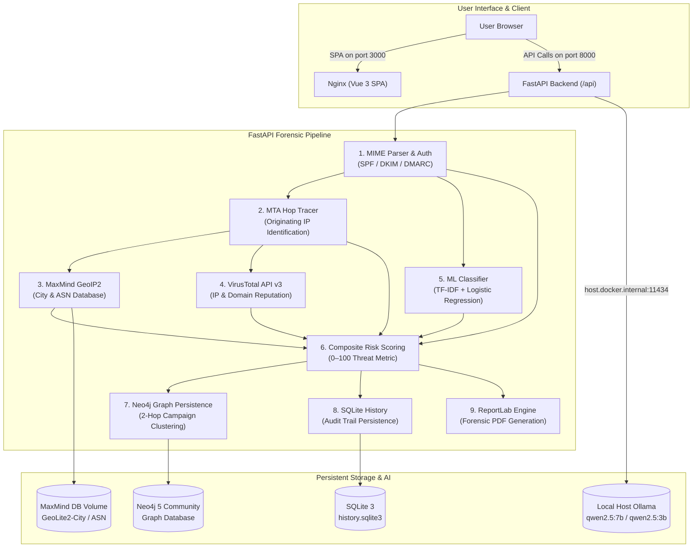

# TrashMail AI — Phishing & Scam Intelligence Platform
**Smart India Hackathon (SIH26106) Project**

TrashMail AI is a forensic email analysis and sender-tracing platform built to counter sophisticated phishing, business email compromise (BEC), and infrastructure-reuse scam campaigns. Unlike conventional tools that rely solely on keyword matching or static blacklists, TrashMail AI parses complete RFC 822 MIME headers to trace true origin IPs across relay hops, scores content using a pre-trained ML classifier (98.9% accuracy on 84,665 real emails), geolocates senders with local MaxMind databases, cross-references threat intelligence via VirusTotal, clusters multi-email scam campaigns in a Neo4j graph, generates court-ready forensic PDF evidence, and provides plain-language AI explanations through local Ollama LLMs with zero cloud rate limits.

---

## System Architecture



---

## Prerequisites

1. **Docker & Docker Compose**: Installed and running (Docker Desktop on macOS/Windows, or Docker Engine on Linux).
2. **Local Ollama LLM** (runs on host machine for native Apple Silicon / GPU hardware acceleration):
   - Install from [ollama.ai](https://ollama.ai)
   - Pull the required models:
     ```bash
     ollama pull qwen2.5:7b
     ollama pull qwen2.5:3b
     ```
   - Start the service: `ollama serve` (verify via `curl http://localhost:11434/api/tags`)
3. **MaxMind GeoLite2 Databases** (free account):
   - Sign up at [maxmind.com/en/geolite2/signup](https://www.maxmind.com/en/geolite2/signup)
   - Download `GeoLite2-City.mmdb` and `GeoLite2-ASN.mmdb`
   - Place them at:
     ```
     backend/app/geo/data/GeoLite2-City.mmdb
     backend/app/geo/data/GeoLite2-ASN.mmdb
     ```
4. **VirusTotal API Key** (optional but recommended):
   - Obtain a free API key at [virustotal.com](https://www.virustotal.com).

---

## Quick Start

### 1. Configure Environment
```bash
cp .env.example .env
```
Edit `.env` and set your `VIRUSTOTAL_API_KEY` (leave empty if testing without external API calls):
```env
VIRUSTOTAL_API_KEY=your_key_here
NEO4J_PASSWORD=trashmail123
```

### 2. Start Ollama on Host
Ensure Ollama is active on your host machine:
```bash
ollama serve &
```

### 3. Launch Docker Compose
```bash
docker compose up --build -d
```

### 4. Access the Platform
- **Web Dashboard**: [http://localhost:3000](http://localhost:3000)
- **FastAPI Interactive Docs**: [http://localhost:8000/docs](http://localhost:8000/docs)
- **Neo4j Browser UI**: [http://localhost:7474](http://localhost:7474) (Username: `neo4j`, Password: `trashmail123`)

---

## Core Features & Modules

| Module | Route / Component | Description |
|---|---|---|
| **Forensic Parser** | `POST /api/analyze` | Walks MIME trees, extracts routing hops, checks domain alignment (Reply-To / Return-Path mismatches), flags executable/script attachments (`.scr`, `.exe`, `.js`), and parses SPF/DKIM/DMARC. |
| **ML Threat Scoring** | `GET /api/model-info` | Scikit-learn Pipeline executing TF-IDF vectorization + Logistic Regression with 0–100 composite weighting. |
| **Origin Geolocation** | `GeoMapPanel.vue` | Offline MaxMind lookup pinpointing the true originating public server location on Leaflet OpenStreetMap tiles. |
| **Threat Intelligence** | VirusTotal API v3 | In-memory cached IOC reputation engine with 4 req/min rate limiting and graceful offline degradation. |
| **Campaign Graph** | `GET /api/graph/{hash}` | Neo4j 2-hop cluster matching (`(e1)-[]-(shared)-[]-(e2)`) detecting when an attacker reuses domains or IPs across targets. |
| **Local AI Briefing** | `POST /api/chat/explain` | Grounded explanation from `qwen2.5:7b` (with auto 3B fallback) translating raw header flags into plain English without prompt injection risk. |
| **Scam Chat Assistant** | `POST /api/chat/ask` | Freeform analysis assistant evaluating pasted message text, SMS scams, or suspicious prompts. |
| **Evidence PDF Export** | `GET /api/reports/{hash}.pdf` | Court-ready forensic evidence report generated using ReportLab Platypus flowables. |
| **Investigation Audit** | `GET /api/history` | Persistent SQLite investigation history table with instant reload and PDF download capabilities. |

---

## Machine Learning Verification

The core classifier pipeline (`phishtrace_classifier.joblib`) was trained on **84,665 deduplicated real emails** from six major public cyber corpora:
- Nazario Phishing Corpus
- Nigerian Fraud (419) Email Corpus
- CEAS 2008 Spam Challenge
- SpamAssassin Public Corpus
- Ling-Spam Corpus
- Enron-Spam Corpus

### Evaluation Metrics
- **Accuracy**: `98.94%`
- **Precision**: `98.86%`
- **Recall**: `99.12%`
- **F1-Score**: `98.99%`
- **Confusion Matrix**: `[[5955, 76], [59, 6610]]` (False Positives: 76 / 6,031; False Negatives: 59 / 6,669)

---

## Known Limitations

1. **Language Scope**: The ML classifier is trained predominantly on English-language corpora. Non-English phishing text may yield lower ML confidence, though header and authentication signals remain language-independent.
2. **VirusTotal Rate Limits**: Free-tier API keys are capped at 4 queries per minute. The system throttles gracefully, but analyzing emails with more than 4 distinct domains takes 60 seconds per batch.
3. **Local LLM Performance**: Ollama inference speed depends on the host machine CPU/GPU. On machines with limited memory, the system automatically falls back from `qwen2.5:7b` to `qwen2.5:3b`.
4. **Spoofed Received Headers**: While TrashMail AI orders hops chronologically and classifies private vs public IP boundaries, a recipient MTA under complete attacker control could inject forged intermediate hops. The system mitigates this by validating authentication-results from the boundary receiver.

---

## License & Credits
Built for the **Smart India Hackathon (SIH26106)**. Includes GeoLite2 data created by MaxMind, available from [maxmind.com](https://www.maxmind.com).
